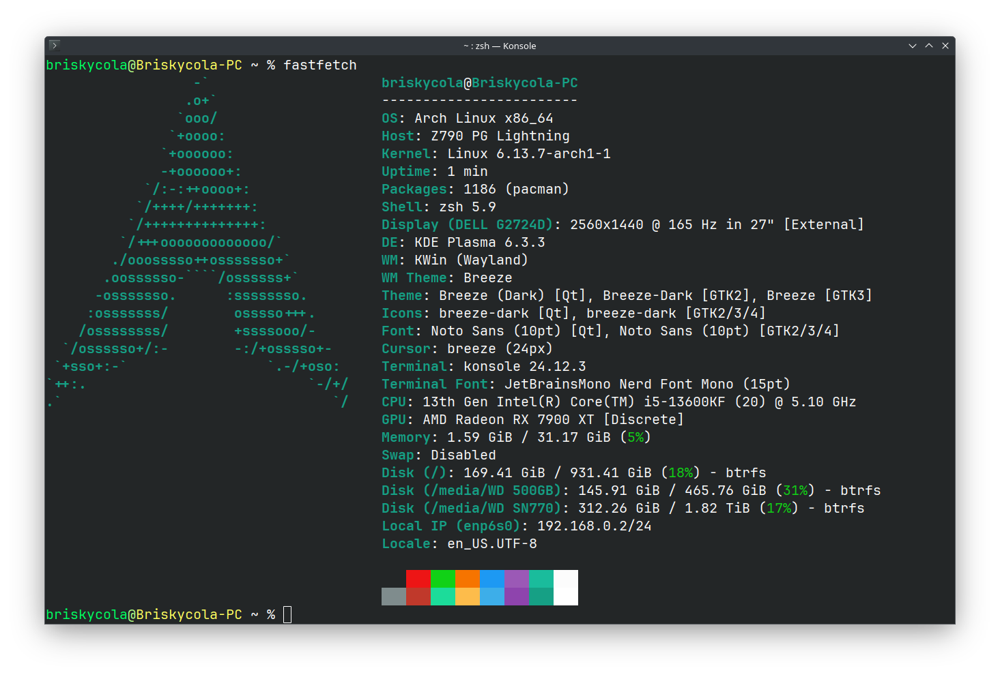

### Dotfiles

This repo is meant to preserve my settings for bash and zsh along with other programs.
I use this all the time when I want to transfer my settings to another computer
or virtual machine. If you want to use these files yourself, follow the installation process.
Here is a preview of how the terminal looks like when these settings are applied.


## Install
To install these dotfiles on your computer you must run the following:
```bash
git clone https://github.com/briskycola/dotfiles
cd dotfiles/
./install.sh
```
